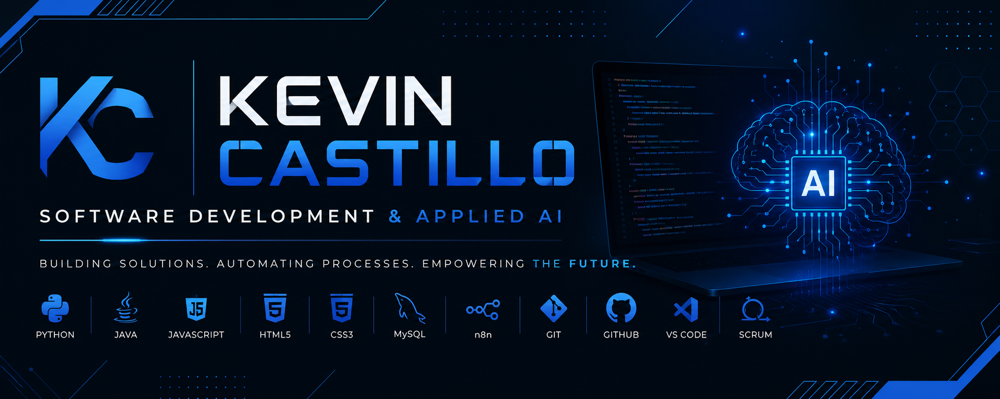

  

# Hi there 👋 I'm Kevin Castillo

### 💻 Software Development & Applied AI Student

I'm a 17-year-old Software Development and Applied AI student from Colombia, currently training at Campuslands.

I'm passionate about technology, automation, and Artificial Intelligence. I enjoy building software, solving problems, and continuously learning new tools and technologies. My goal is to become a Full-Stack Software Engineer specialized in AI Engineering and Intelligent Automation.

---

## 🚀 About Me

* 🎓 Software Development & Applied AI Student at Campuslands
* 🌎 Based in Floridablanca, Colombia
* 🤖 Interested in Artificial Intelligence, Automation, and Software Engineering
* 📚 Currently expanding my knowledge in software development and modern technologies
* 🎯 Goal: Build scalable applications and AI-powered solutions

---

## 🛠️ Technologies & Tools

### Programming Languages

* Python
* Java
* JavaScript
* HTML5
* CSS3
* SQL

### Database

* MySQL

### Automation

* n8n

### Tools

* Git
* GitHub
* Visual Studio Code

### Methodologies

* Scrum

---

## 💡 Featured Project

🤖 **Telegram Coffee Shop Chatbot**

Designed and developed an automated Telegram chatbot for a coffee shop using n8n workflows, helping automate customer interactions and improve communication.

---

## 🌱 Currently Learning

* Artificial Intelligence Engineering
* Intelligent Automation
* Software Architecture
* Full-Stack Development
* Modern Software Engineering Practices

---

## 🌎 Languages

* 🇪🇸 Spanish — Native
* 🇺🇸 English — B1

---

## 📫 Connect with Me

📧 Email: **[firexk993@gmail.com](mailto:firexk993@gmail.com)**

🐙 GitHub: **github.com/castillokfirex**

🌐 Portfolio: **castillokfirex.github.io/portfolio-kevin-castillo**

---

> *"Every project is another opportunity to learn, improve, and build something meaningful."*
